# SarkariSaathi: Voice AI for Government Schemes
**AI for Bharat Hackathon by AWS - Social Impact Category**  
> Empowering millions of Indians to access their rightful government benefits through voice-first AI

---

## Executive Summary

India allocates ₹3+ lakh crores annually for 400+ welfare schemes, yet only 37% of eligible citizens access them due to awareness gaps and language barriers. SarkariSaathi is a voice-first AI assistant that enables users to discover and apply for government benefits through natural conversations in their native language—simply say *"Meri beti ki shaadi hai, koi scheme milegi?"* and instantly get personalized recommendations. The platform combines AWS Transcribe for multilingual speech recognition, Amazon Bedrock with RAG for hallucination-free responses, and OpenSearch for semantic scheme matching. Powered by AWS's AI/ML services with DPDP-compliant architecture, SarkariSaathi bridges the digital divide for 500M+ low-literacy Indians, democratizing access to welfare through the most natural interface: voice.

---

## The Problem

- **₹3+ lakh crores allocated annually, only 37% utilization**: Billions in welfare funds remain unclaimed
- **Awareness gap**: Most eligible citizens unaware of schemes they qualify for
- **Language barriers**: Official documentation primarily in English/Hindi limits accessibility
- **Digital divide**: Rural and low-literacy populations struggle with text-based interfaces
- **Complex bureaucracy**: Navigation through government processes is overwhelming
- **Fragmented information**: Scheme details scattered across multiple portals

---

## The Solution — How It Works

SarkariSaathi is a voice-enabled AI assistant that understands natural language queries in multiple Indian languages, identifies relevant schemes, and guides users through the application process.

**Technical Flow in 5 Steps:**

1. **Voice Input & Recognition**
   - User speaks in their native language (Hindi, English, or code-mixed)
   - AWS Transcribe converts speech to text with custom vocabulary for Indian government terms
   - Language detection identifies the user's preferred language

2. **Intent Understanding & Context Building**
   - Amazon Lex recognizes user intent (e.g., "looking for marriage assistance")
   - Amazon Comprehend extracts entities (age, location, occupation, life event)
   - Conversation context maintained across multiple turns in DynamoDB

3. **Intelligent Scheme Retrieval (RAG Pipeline)**
   - User query converted to vector embedding using Amazon Bedrock Titan
   - Semantic search in OpenSearch finds relevant schemes from 400+ options
   - Eligibility filters applied based on user profile
   - Top-k schemes retrieved with full details from RDS and S3

4. **Response Generation**
   - Retrieved scheme data + user context fed to Amazon Bedrock (Claude 3.5 Sonnet)
   - LLM generates accurate, conversational response in simple language
   - Fact-checking layer ensures no hallucinations
   - Response optimized for voice output

5. **Voice Output & Next Steps**
   - AWS Polly converts text response to natural speech
   - User hears scheme details, eligibility, documents needed, nearest offices
   - Follow-up actions offered: save scheme, get directions, start application
   - Session saved for continuity

**System Architecture:**

```mermaid
%%{init: {'theme':'base', 'themeVariables': { 'fontSize':'18px', 'primaryColor':'#fff', 'primaryTextColor':'#000', 'primaryBorderColor':'#000', 'lineColor':'#ffffff', 'secondaryColor':'#fff', 'tertiaryColor':'#fff', 'edgeLabelBackground':'#333', 'clusterBkg':'#333', 'clusterBorder':'#fff', 'defaultLinkColor':'#ffffff'}}}%%
flowchart TD
    A["👤 User Voice Input<br/>(Hindi/English/Code-mixed)"] --> B["AWS Transcribe<br/>Speech to Text"]
    B --> C["Amazon Lex<br/>Intent Recognition"]
    C --> D["AWS Lambda<br/>Business Logic"]
    
    D --> E["RAG Pipeline<br/>(Retrieval Augmented Generation)"]
    
    E --> F["Amazon Bedrock<br/>Titan Embeddings"]
    E --> G["Amazon OpenSearch<br/>Vector Search"]
    E --> H["Amazon S3<br/>Scheme Documents"]
    E --> I["DynamoDB<br/>User Profiles"]
    E --> J["Amazon RDS<br/>Scheme Database"]
    
    D --> K["Amazon Bedrock<br/>Claude 3.5 Sonnet<br/>(LLM Response)"]
    K --> L["AWS Polly<br/>Text to Speech"]
    L --> M["🔊 Voice Response<br/>to User"]
    
    N["Amazon CloudFront<br/>(CDN)"] --> O["API Gateway"]
    O --> D
    
    linkStyle default stroke:#ffffff,stroke-width:3px
    
    style A fill:#bbdefb,stroke:#1565c0,stroke-width:4px,color:#000
    style M fill:#c8e6c9,stroke:#2e7d32,stroke-width:4px,color:#000
    style E fill:#ffe0b2,stroke:#e65100,stroke-width:4px,color:#000
    style K fill:#f8bbd0,stroke:#ad1457,stroke-width:4px,color:#000
    style D fill:#fff9c4,stroke:#f57f17,stroke-width:4px,color:#000
```



The architecture follows a serverless pattern:
- **Frontend**: User interacts via voice (web/WhatsApp)
- **API Layer**: CloudFront + API Gateway route requests to Lambda
- **AI/ML Layer**: Transcribe (speech-to-text) → Lex (intent) → Bedrock (LLM) → Polly (text-to-speech)
- **Data Layer**: OpenSearch (vector search), DynamoDB (profiles), RDS (schemes), S3 (documents)
- **RAG Pipeline**: Retrieves verified scheme data before LLM generation to prevent hallucinations

---

## Team

**Team Name**: Suicide Squad

**Team Members**:
- Karan Juneja - [LinkedIn](https://www.linkedin.com/in/karanjuneja1201/)
- Aashna Goyal - [LinkedIn](https://www.linkedin.com/in/aashna-goyal-716596326/)
- Lakshay Gupta - [LinkedIn](https://www.linkedin.com/in/lakshay-gupta136/)
- Ravleen Kaur - [LinkedIn](https://www.linkedin.com/in/ravleen-kaur-799a18330/)

**Team Skills**: AWS Solutions Architecture, AI/ML Engineering (NLP, RAG, Vector Search), Full-Stack Development (React, Node.js, Python), Voice Interface Design, Social Impact Product Management

---

## AWS Services & Why

| Service | Purpose |
|---------|---------|
| **Amazon Bedrock (Claude 3.5 Sonnet)** | LLM for natural language understanding and conversational responses |
| **Amazon Bedrock Knowledge Bases** | RAG pipeline for accurate, hallucination-free scheme information retrieval |
| **AWS Transcribe** | Real-time speech-to-text with Indian language support |
| **AWS Polly** | Neural text-to-speech for natural voice responses |
| **Amazon Lex** | Intent recognition and dialog management |
| **Amazon Comprehend** | Entity extraction from user queries |
| **Amazon OpenSearch** | Vector database for semantic scheme search |
| **Amazon DynamoDB** | User profiles and conversation history |
| **Amazon RDS (PostgreSQL)** | Structured scheme database |
| **Amazon S3** | Document storage and scheme PDFs |
| **AWS Lambda** | Serverless compute for API endpoints |
| **Amazon API Gateway** | RESTful API management |
| **AWS Step Functions** | Orchestration of multi-step RAG pipeline |
| **Amazon CloudFront** | CDN for low-latency access |
| **Amazon Cognito** | User authentication |
| **AWS CloudWatch** | Monitoring and logging |
| **AWS X-Ray** | Distributed tracing |
| **AWS Secrets Manager** | Secure credential storage |
| **AWS IAM** | Access control and security |

---

## Innovation Highlights

**1. Voice-First for Digital Inclusion**
- First government scheme platform with native voice interface
- Supports code-mixed languages (Hinglish, Tanglish) reflecting real usage

**2. RAG-Powered Accuracy**
- Eliminates LLM hallucinations through retrieval-augmented generation
- Fact-checking layer ensures 98%+ accuracy

**3. Hyper-Local Context**
- State-specific scheme recommendations
- Nearest application center discovery with GPS integration

**4. Multi-Channel Accessibility**
- WhatsApp integration (750M+ users in India)
- Offline mode for low-connectivity areas

**5. Ethical AI Design**
- DPDP Act 2023 compliance with India data localization
- No premium tier for citizens - completely free

---

## Hackathon MVP vs Full Vision

| Feature | Hackathon MVP | Full Product Vision |
|---------|---------------|---------------------|
| **Languages** | Hindi, English | 10+ Indian languages |
| **Schemes** | 50 central schemes | 400+ central + all states |
| **Channels** | Web app + WhatsApp bot | Web, Android, iOS, WhatsApp, IVR, SMS |
| **Offline Mode** | Basic scheme caching | Full offline with background sync |
| **User Profiles** | Session-based context | Persistent profiles with renewal tracking |
| **Application Help** | Step-by-step guidance | AI form-filling + document OCR |
| **Integrations** | OpenSearch RAG pipeline | DigiLocker, Aadhaar, CSC, government portals |
| **Target Users** | Hindi/English speakers | All 22 official Indian language speakers |

**Note**: The hackathon MVP demonstrates the core voice-first AI pipeline.

---

## Target Users

**1. Rural Beneficiary (Ramesh, 45)**: Small farmer with limited literacy, prefers Hindi. Needs agricultural subsidies and pension schemes.

**2. Urban Low-Income Worker (Priya, 32)**: Domestic worker, literate but time-constrained. Needs healthcare and education benefits for children.

**3. Senior Citizen (Lakshmi, 68)**: Retired teacher comfortable with Tamil. Needs pension schemes and healthcare benefits.

**4. Young Parent (Arjun, 28)**: Tech-savvy small business owner. Needs child education benefits and business loans.

---

## Core Features

| Feature | What It Does | Key Metric |
|---------|--------------|------------|
| **Voice-First Interface** | Multi-language speech recognition with natural conversation flow | >90% voice recognition accuracy |
| **Intelligent Scheme Discovery** | AI-powered intent recognition and scheme matching | >85% relevance in top 3 results |
| **Comprehensive Scheme Info** | Eligibility, benefits, documents, nearest offices | 100% coverage of 50 schemes |
| **Document Guidance** | Simple explanations and alternatives for required documents | 80% documents have alternatives |
| **Application Assistance** | Step-by-step guidance and tracking | >70% task completion rate |
| **Location Services** | GPS-based nearest office finder with directions | <1km location accuracy |
| **Personalized Profiles** | Save demographics, track applications, set reminders | <2 min profile creation |
| **Offline Mode** | Access saved schemes without internet | 20+ schemes cacheable |

---

## Technical Architecture

**RAG Pipeline Flow:**

```
User Query → Embedding Generation (Titan) → Vector Search (OpenSearch) → 
Retrieve Top-K Schemes → Apply Eligibility Filters → Rank by Relevance → 
Fetch Full Details (S3 + DynamoDB) → Construct Context → LLM Prompt → 
Amazon Bedrock (Claude 3.5) → Voice-Optimized Output
```

The RAG pipeline ensures factual accuracy by retrieving verified scheme information from government sources before generating responses. User queries are converted to vector embeddings, semantically matched against 400+ schemes in OpenSearch, filtered by eligibility, and used to construct context for the LLM, eliminating hallucinations.

---

## Success Metrics

| Category | Metric | Target |
|----------|--------|--------|
| **User Adoption** | Monthly Active Users | 100K in 6 months |
| **Accuracy** | Scheme Match Relevance | >85% |
| **Impact** | Applications Initiated | 10K in 6 months |
| **Performance** | Response Latency | <3 seconds |
| **Availability** | System Uptime | >99.5% |
| **Satisfaction** | User Rating | >4.2/5 |

---

## Business Model

**Core Principle**: SarkariSaathi is completely free for all citizens - no premium tiers, no paywalls, no ads. Revenue comes exclusively from institutional partners (B2B model).

**B2B Revenue Streams:**
1. **State Government Partnerships** (₹2L-₹10L/month): White-label solutions, custom integrations, analytics dashboards
2. **NGO Partnerships** (₹25K-₹1L/month): Branded interfaces, impact metrics, beneficiary tracking
3. **CSC Integration** (Revenue share): Commission on successful applications facilitated through 40,000+ Common Service Centers
4. **Corporate CSR Programs** (₹5L-₹25L/year): Employee benefit programs, community outreach, impact reporting

Projections show self-sustainability by Year 3 through B2B revenue.

---

## Competitive Positioning

| Feature | SarkariSaathi | myScheme.gov.in | Umang App | JanSahas | CSC Portal |
|---------|---------------|-----------------|-----------|----------|------------|
| **Voice Interface** | ✅ Primary | ❌ None | ❌ None | ❌ None | ❌ None |
| **Language Support** | 10+ Indian languages | English, Hindi | English, Hindi, 13 regional | Hindi, English | English, Hindi |
| **Scheme Coverage** | 400+ central + state | 200+ central | 1,200+ services | Limited | Varies |
| **Offline Access** | ✅ Saved schemes | ❌ None | ❌ None | ❌ None | ❌ None |
| **WhatsApp Integration** | ✅ Full support | ❌ None | ❌ None | ❌ None | ❌ None |
| **Conversational AI** | ✅ Natural language | ❌ Form-based | ❌ Menu-driven | ❌ Search-based | ❌ Form-based |
| **Eligibility Matching** | ✅ AI-powered | ✅ Rule-based | ❌ Manual | ✅ Basic | ❌ Manual |
| **Target Audience** | Rural, low-literacy | Literate users | Tech-savvy | Urban | CSC operators |
| **Accessibility** | High (voice, multilingual) | Medium | Medium | Low | Low |

---

## Hackathon Deliverables

**Technical Deliverables:**
- Working MVP with voice interface (Hindi, English)
- 50 government schemes integrated
- WhatsApp bot prototype
- RAG pipeline with OpenSearch
- Mobile-responsive web application
- Architecture diagram
- API documentation
- Deployment guide
- Demo video (5 minutes)
- Pitch deck

**Success Metrics for Hackathon:**
- Voice recognition accuracy >90% for Hindi/English
- Scheme recommendation relevance >85%
- Response latency <3 seconds
- Successful end-to-end user journey completion
- DPDP Act 2023 compliance validation

---

## Demo Scenarios

1. **Rural farmer discovering agricultural schemes via voice**: Ramesh asks in Hindi about farming subsidies, gets personalized recommendations with nearest office locations

2. **Senior citizen finding pension schemes in Tamil**: Lakshmi speaks in Tamil about retirement benefits, receives clear explanations of eligibility and application process

3. **Young parent exploring education benefits via WhatsApp**: Arjun messages on WhatsApp about child education schemes, gets rich media responses with document checklists

4. **Urban worker checking healthcare schemes with offline mode**: Priya accesses saved scheme details without internet, reviews requirements for Ayushman Bharat

---

## Footer

**Team**: Suicide Squad  
**Contact**: Karan Juneja - [LinkedIn](https://www.linkedin.com/in/karanjuneja1201/)

**Document Version**: 1.0 (Hackathon Submission)  
**Date**: February 15, 2026  
**Status**: Final Submission — AI for Bharat Hackathon by AWS
